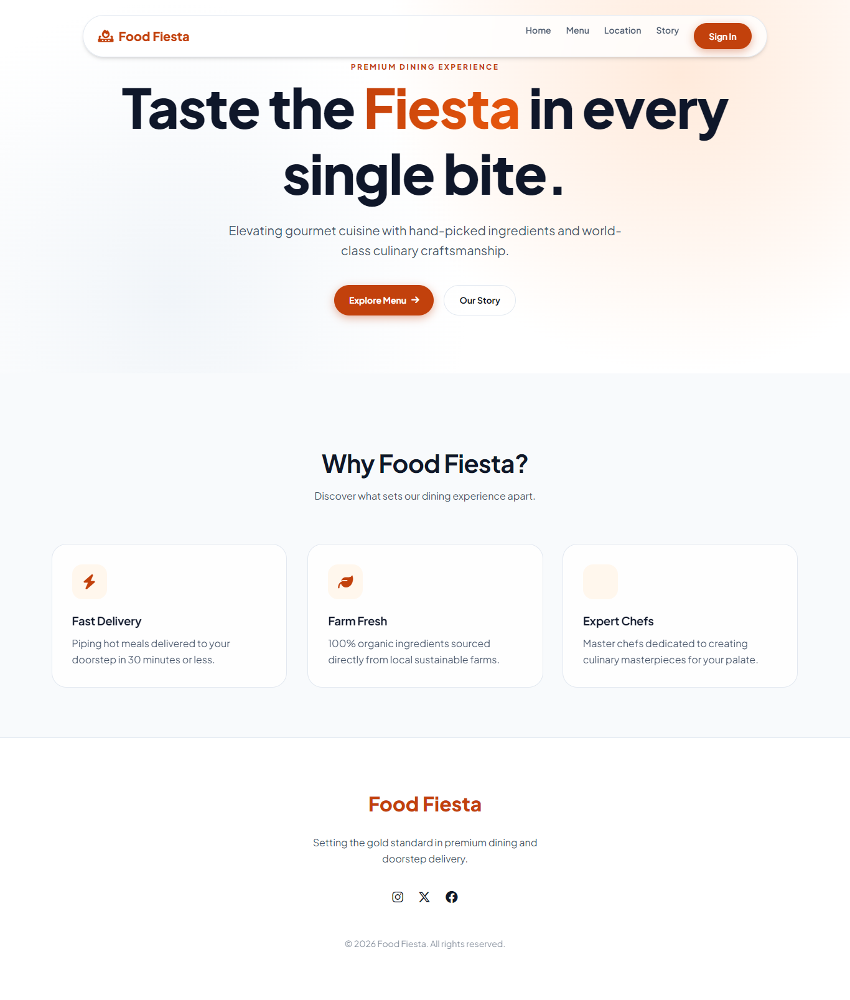
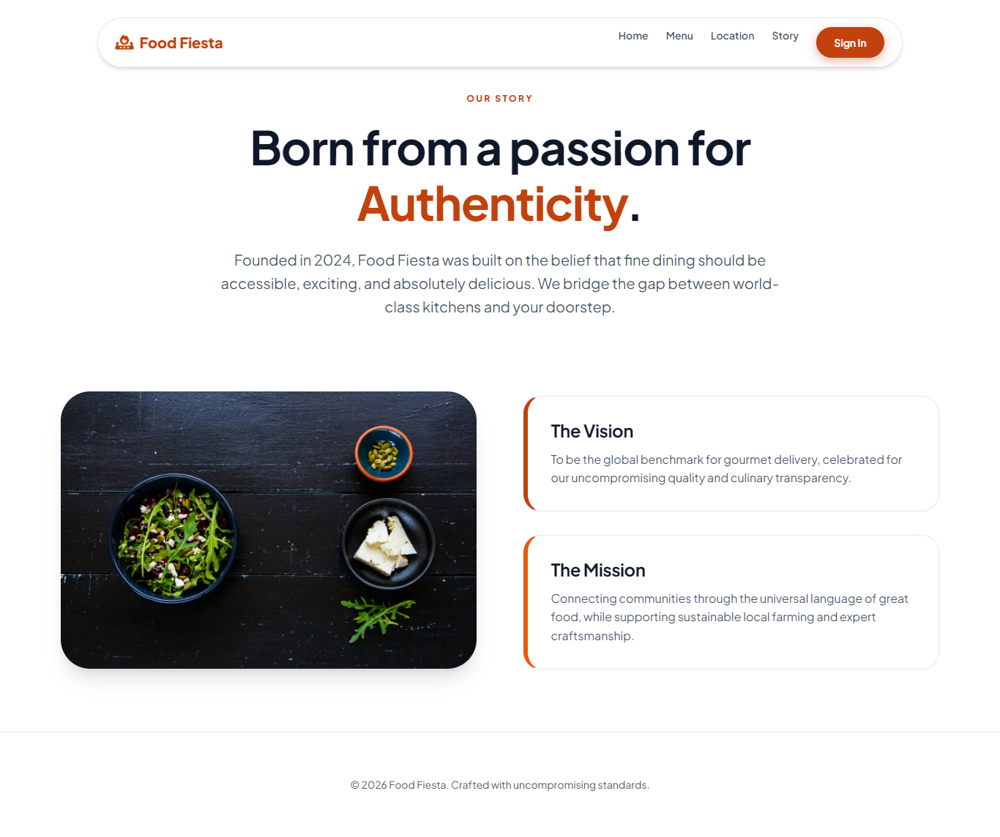
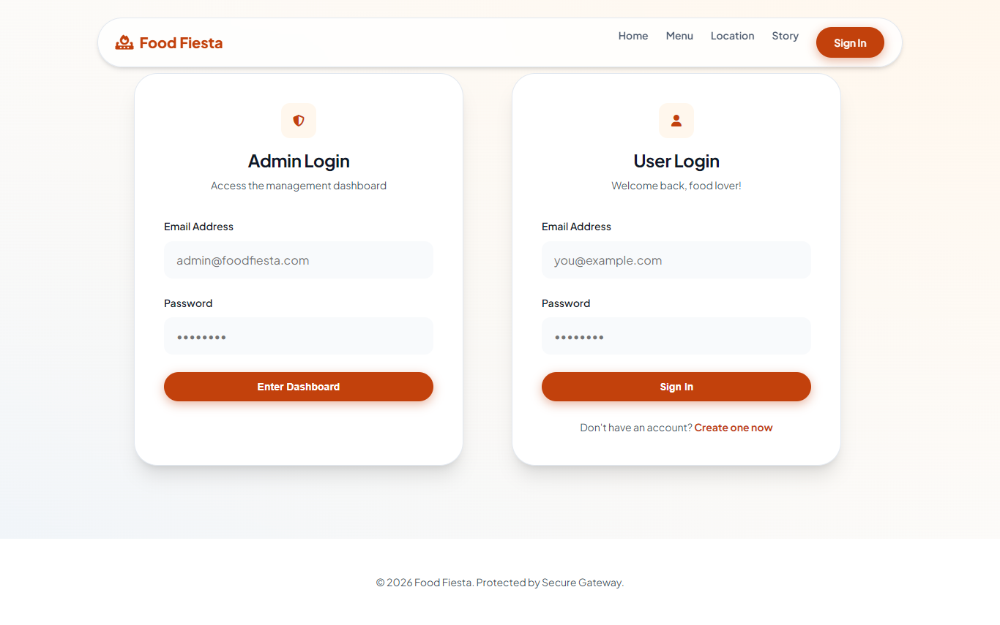
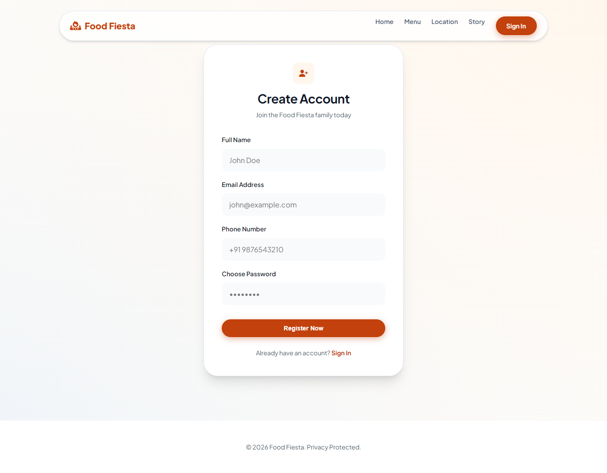
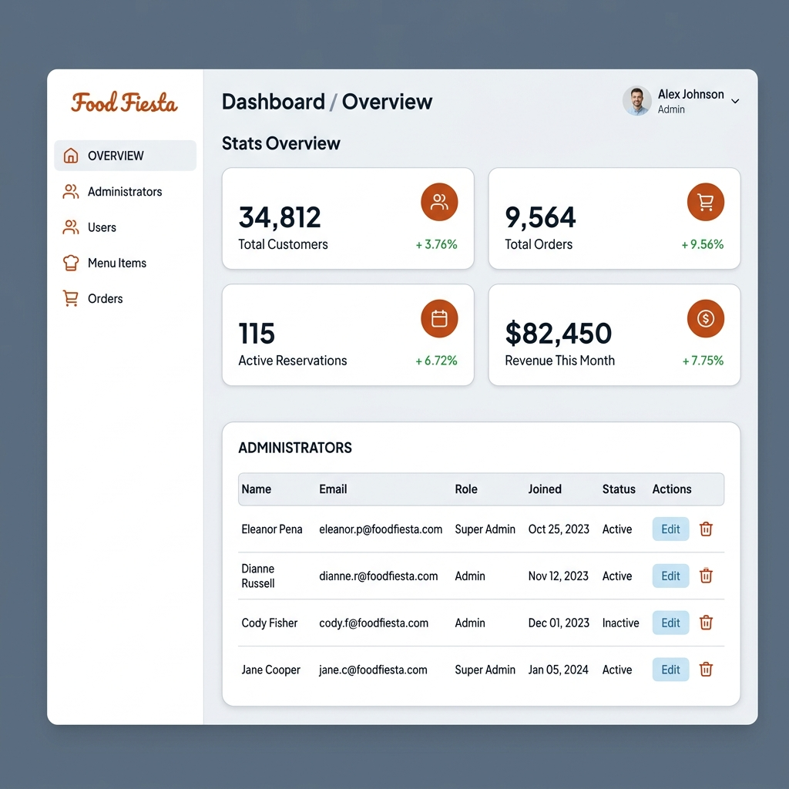

# Food Fiesta - Spring Boot Fullstack Project

**Food Fiesta** is a Spring Boot fullstack dining management application built with **Java 21**, **Spring Boot 3.4.2**, **Thymeleaf**, **Spring Security**, **Spring Data JPA**, and **H2** for quick local development.

The project can also be configured to use PostgreSQL for deployment or production-style testing.

## Project Tags

`#SpringBoot` `#Java21` `#RestAPI` `#BackendProject` `#H2Database` `#PostgreSQL` `#Thymeleaf` `#FullstackProject`

---

[]

---

## Interface Preview

### Home Page

  

### About Page

  

### Authentication & Security

  
  

### Products

  

### User Experience & Dashboard

  

### Admin Management Console

  

